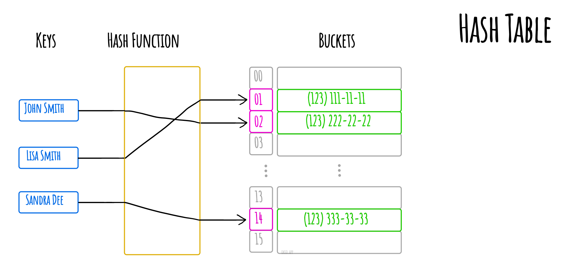

# Хэш таблица

**Хеш-таблица** - структура данных, реализующая абстрактный тип данных *ассоциативный массив*, т.е. структура, которая
*связывает ключи со значениями*. Хеш-таблица использует *хеш-функцию* для вычисления индекса в массиве, в котором может
быть найдено желаемое значение. Ниже представлена хеш-таблица, в которой ключом выступает имя человека, а значениями
являются телефонные номера. Хеш-функция преобразует ключ-имя в индекс массива с телефонными номерами.

*Made with [okso.app](https://okso.app)*

В идеале хеш-функция будет присваивать элементу массива уникальный ключ. Однако большинство реальных хеш-таблиц
используют несовершенные хеш-функции. Это может привести к ситуациям, когда хеш-функция генерирует одинаковый индекс для
нескольких ключей. Данные ситуации называются коллизиями и должны быть как-то разрешены.

Существует два варианта решения коллизий - хеш-таблица с цепочками и с открытой адресацией.

Метод цепочек подразумевает хранение значений, соответствующих одному и тому же индексу в виде связного списка(цепочки).

Метод открытой адресации помещает значение, для которого получен дублирующий индекс, в первую свободную ячейку.

## Ссылки

- [Wikipedia](https://ru.wikipedia.org/wiki/%D0%A5%D0%B5%D1%88-%D1%82%D0%B0%D0%B1%D0%BB%D0%B8%D1%86%D0%B0)
- [YouTube](https://www.youtube.com/watch?v=rVr1y32fDI0)
