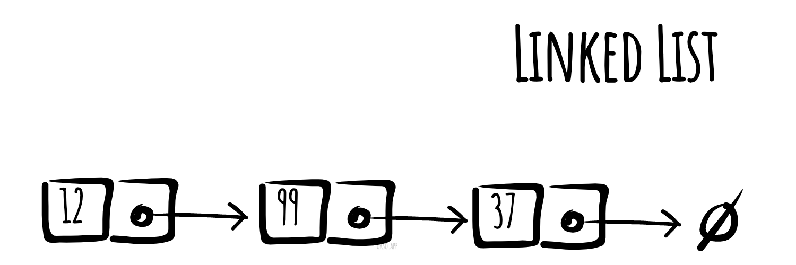

# 链表

在计算机科学中, 一个 **链表** 是数据元素的线性集合, 元素的线性顺序不是由它们在内存中的物理位置给出的。 相反, 每个元素指向下一个元素。它是由一组节点组成的数据结构,这些节点一起,表示序列。

在最简单的形式下，每个节点由数据和到序列中下一个节点的引用(换句话说，链接)组成。这种结构允许在迭代期间有效地从序列中的任何位置插入或删除元素。

更复杂的变体添加额外的链接，允许有效地插入或删除任意元素引用。链表的一个缺点是访问时间是线性的(而且难以管道化)。

更快的访问，如随机访问，是不可行的。与链表相比，数组具有更好的缓存位置。



*Made with [okso.app](https://okso.app)*

## 基本操作的伪代码

### 插入

```text
Add(value)
  Pre: value is the value to add to the list
  Post: value has been placed at the tail of the list
  n ← node(value)
  if head = ø
    head ← n
    tail ← n
  else
    tail.next ← n
    tail ← n
  end if
end Add
```

```
Prepend(value)
 Pre: value is the value to add to the list
 Post: value has been placed at the head of the list
 n ← node(value)
 n.next ← head
 head ← n
 if tail = ø
   tail ← n
 end
end Prepend
```

### 搜索

```text
Contains(head, value)
  Pre: head is the head node in the list
       value is the value to search for
  Post: the item is either in the linked list, true; otherwise false
  n ← head
  while n != ø and n.value != value
    n ← n.next
  end while
  if n = ø
    return false
  end if
  return true
end Contains
```

### 删除

```text
Remove(head, value)
  Pre: head is the head node in the list
       value is the value to remove from the list
  Post: value is removed from the list, true, otherwise false
  if head = ø
    return false
  end if
  n ← head
  if n.value = value
    if head = tail
      head ← ø
      tail ← ø
    else
      head ← head.next
    end if
    return true
  end if
  while n.next != ø and n.next.value != value
    n ← n.next
  end while
  if n.next != ø
    if n.next = tail
      tail ← n
    end if
    n.next ← n.next.next
    return true
  end if
  return false
end Remove
```

### 遍历

```text
Traverse(head)
  Pre: head is the head node in the list
  Post: the items in the list have been traversed
  n ← head
  while n != ø
    yield n.value
    n ← n.next
  end while
end Traverse
```

### 反向遍历

```text
ReverseTraversal(head, tail)
  Pre: head and tail belong to the same list
  Post: the items in the list have been traversed in reverse order
  if tail != ø
    curr ← tail
    while curr != head
      prev ← head
      while prev.next != curr
        prev ← prev.next
      end while
      yield curr.value
      curr ← prev
    end while
   yield curr.value
  end if
end ReverseTraversal
```

## 复杂度

### 时间复杂度

| Access    | Search    | Insertion | Deletion  |
| :-------: | :-------: | :-------: | :-------: |
| O(n)      | O(n)      | O(1)      | O(1)      |

### 空间复杂度

O(n)

## 参考

- [Wikipedia](https://en.wikipedia.org/wiki/Linked_list)
- [YouTube](https://www.youtube.com/watch?v=njTh_OwMljA&index=2&t=1s&list=PLLXdhg_r2hKA7DPDsunoDZ-Z769jWn4R8)
